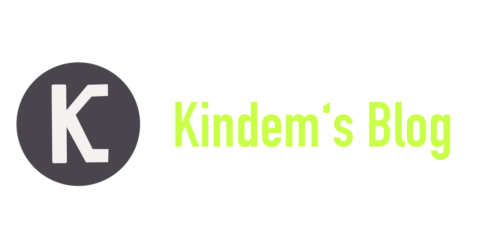
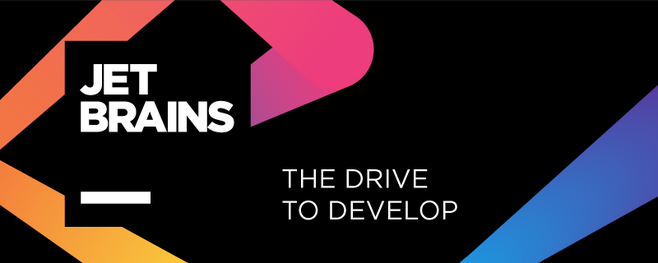

<center>
<div></div>
<div>
    
    
    
</div>
</center>

---

# 说明

该仓库是 [Kindem 的博客](https://www.kindem.xyz/) 源码仓库，仓库中存放了前后端代码，欢迎参考学习。

# 技术栈

* 前端：`Next.js` + `React`
* 后端：`Egg.js` + `Sequalize`

# 调试

```shell
cd frontend
yarn dev

cd ../backend
yarn dev
```

# 运行

```shell
cd frontend
yarn build
yarn start

cd ../backend
yarn start
```

# 赞助

<a href="https://www.jetbrains.com/?from=blog-v4">
    
</a>
